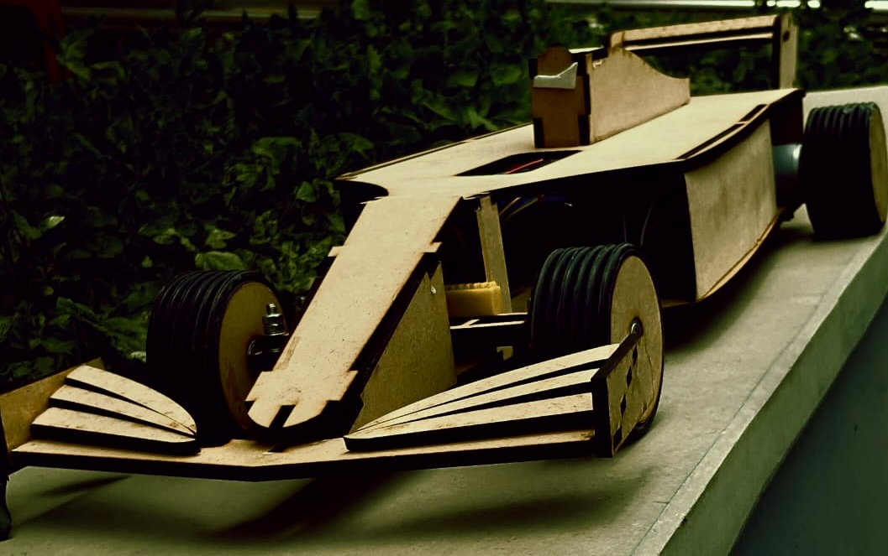

# Voice-Control-RC-Car
## PIS Endsem Project - Arduino Based Project

## Concept:
- An F1 Car made from reinforced Cardboard and Motors, Battery Packs and many more components.
- Design Inspiration: Mercedes W12- Silver Arrow
## Working
This is a Voice Controlled Car where we had programmed 4 commands to perform the respective actions:
* **"FORWARD"** - Instructs the car to move forwards.
* **"BACK"** - Instructs the car to move backwards.
* **"RIGHT"** - Instructs the car to move to the right.
* **"LEFT"** - Instructs the car to move to the left.
There's a steering mechanism in place to facilitate the RIGHT and LEFT movements.
## Stuff we've used:
- We've used 2: 20V - DC Motors as the Chassis was pretty heavy and we needed powerful motors to keep the car moving.
- Bluetooth Module connected the App on the phone with the whole Arduino system where we had the input Voice commands.
- UltraSonic sensors we're also installed to keep the car from colliding if the car got too close to an obstacle.
- To power the powerful DC motors we installed 2 battery packs which were 15V each.
## Installation
- Install Arduino locally.
-  Clone the repo
   ```sh
   git clone https://github.com/pendi1901/Voice-Control-RC-Car.git
   ```
## Contributing
To contribute to this project:
1. Create a fork of this repo
2. Create your Mod Branch (`git checkout -b mod/DopeUpdate`)
3. Commit your Changes (`git commit -m 'Add some DopeUpdate'`)
4. Push to the Branch (`git push origin mod/DopeUpdate`)
5. Open a Pull Request
All contributions are **highly appreciated**.
## License
Feel free to clone and modify according to your needs. But please give desirable CREDITS and STAR this repository!
Distributed under the MIT License. See <a href="https://github.com/pendi1901/Voice-Control-RC-Car/blob/main/LICENSE.MD">LICENSE</a> for more information.
## Project Credits:
 -  Alvin Joseph Ambooken  - alvin20357@iiitd.ac.in
 -  Daksh Gulati           - daksh20048@iiitd.ac.in
 -  Pratyush Jain          - pratyush20396@iiitd.ac.in
 -  Ritvik Pendyala        - pendyala20096@iiitd.ac.in
